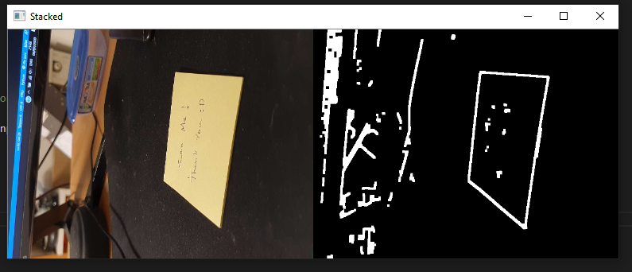
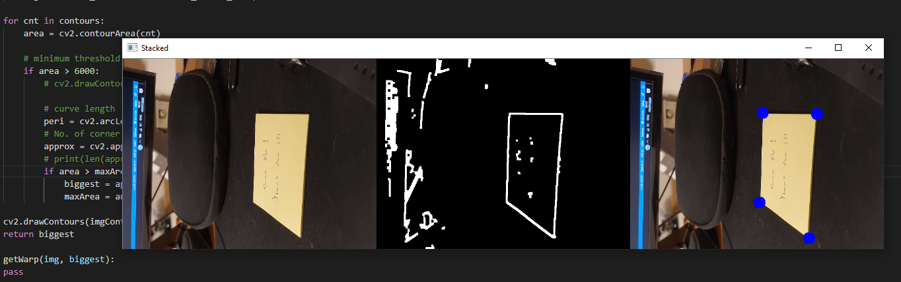
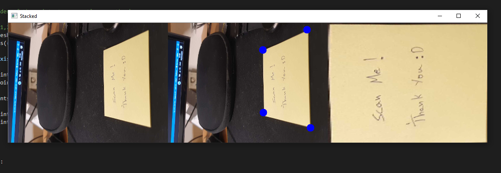

# Document Scanner

To identify a document in real-time from a video stream and warp the identified document on to screen.

### Steps in Scanning

##### 1. Identify Edges

##### 2. Detect Corners of the Document

##### 3. Warp the detected part into an image

