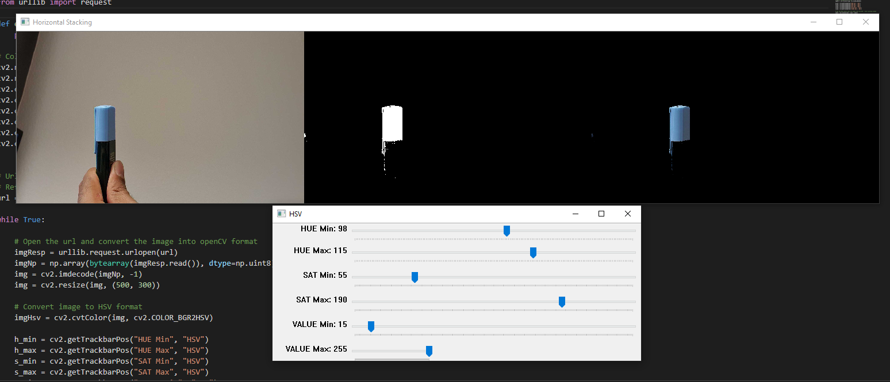
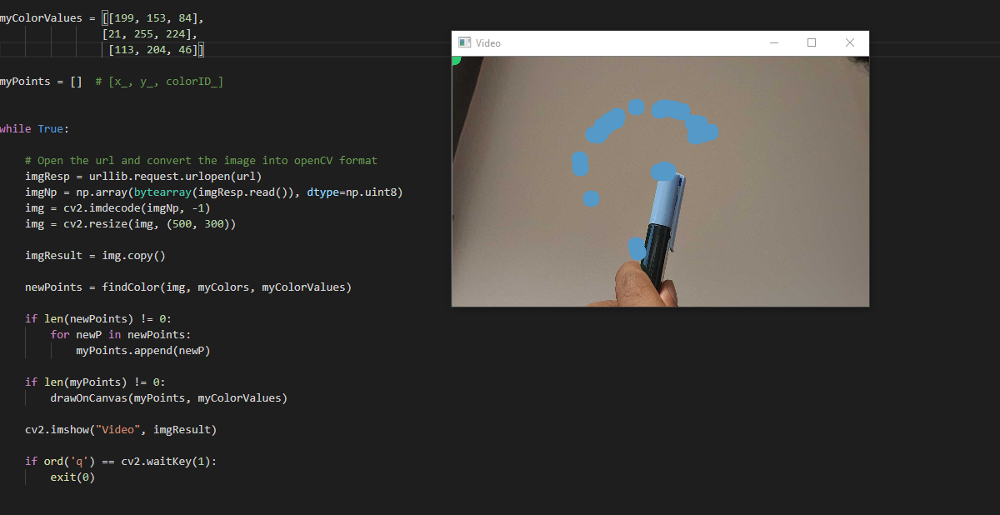

# Virtual Paint 

To Capture real-time movement of a colored pen on the screen and draw a path of the pen.

This project connects a mobile camera wirelessly to the code as a webcam, displays the camera recording on the screen as a stream of pictures.

### Requirements
* opencv-python
* urllib
* numpy

### How to Run:
1. Run `color_picker.py` to manually set the HSV values to mask the image to output only a particular color.
2. Update `virtual_paint.py` with the manually set values and also update RGB values of the colors to be displayed on the screen.
3. Run `virtual_paint.py` to see the real-time video and move the pen across the screen to create a path.

### Image References

##### Color Picking

##### Virtual Paint

